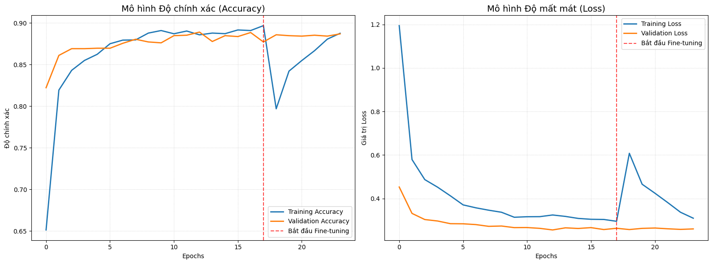
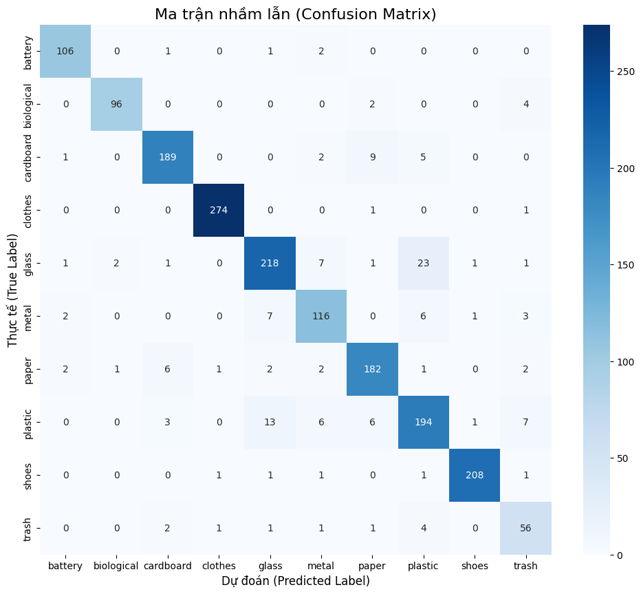
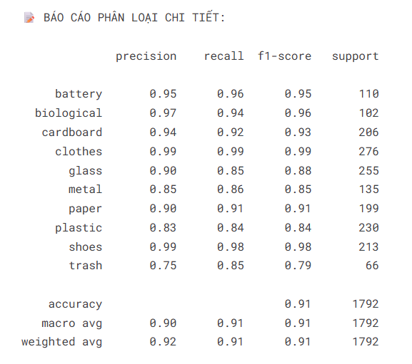

# ♻️ EcoSort by Bao - Ứng Dụng Phân Loại Rác Thông Minh
> Ứng dụng phân loại rác bằng AI sử dụng Flutter, TFLite và Gemini AI.

[](./CHANGELOG.md)
[](https://flutter.dev)
[](./LICENSE)
[](./SECURITY.md)

Ứng dụng sử dụng trí tuệ nhân tạo (AI) tiên tiến để nhận diện và phân loại rác thải qua hình ảnh, giúp người dùng xử lý rác đúng cách và bảo vệ môi trường.

## 📌 Tổng quan

**EcoSort by Bao** là ứng dụng hỗ trợ phân loại rác thải thông minh thông qua hình ảnh.

Hệ thống kết hợp:
- ⚡ **TFLite (Offline)** – nhận diện nhanh ngay trên thiết bị
- 🌐 **Gemini AI (Online)** – phân tích nâng cao khi cần
- 🧠 **Google ML Kit** – bóc tách vật thể chính xác

→ Giúp người dùng phân loại rác đúng cách trong điều kiện thực tế.

---

## 📸 Giao diện chính của ứng dụng 

| Trang chủ (Home Screen) | Bản đồ mới v0.5.4 (New Map Screen) |
|:---:|:---:|
|  |  |

| Nhật ký & Tác động v0.5.4 (History & Impact) | Thông tin ứng dụng v0.5.4 (About Screen) |
|:---:|:---:|
|  |  |

---

## 🎥 Video Demo

> ⚠️ **Lưu ý**: Video demo hiện tại đang ở phiên bản **v0.0.2**. Ứng dụng đã được cập nhật rất nhiều về giao diện (Modern UI) và các chức năng mới ở phiên bản hiện tại (**v0.5.6**). Video demo cho phiên bản mới nhất sẽ sớm được cập nhật.

👉 [Xem Video Demo trên YouTube (v0.0.2)](https://youtu.be/YuI4tK1fNLU?si=LTzk0kVj0328i7m5)

---

## 🚀 Tính năng nổi bật

- 📷 Nhận diện rác bằng AI (camera & thư viện ảnh)
- 🧠 Cơ chế AI kép (Offline → Online fallback) với **hiển thị chính xác nguồn phân tích**: AI Gemini (Online), AI Local (Offline), hoặc AI Offline (Gemini không khả dụng)
- ⚡ **Tối ưu hóa Tốc độ Phân tích cực hạn**: Tích hợp nén ảnh Native-code về 224x224 trước khi giải mã trên Dart (giảm thời gian decode xuống <15ms), tự động nén ảnh gửi đi lên Gemini API chỉ còn ~15KB, chạy song song tác vụ phân tách ML Kit với hoạt ảnh quét (rút ngắn thời gian quét còn 1.8s) để tăng tốc độ xử lý tổng thể lên tối đa.
- ⚙️ **Lưu ý về Tự động Huấn luyện (Auto-Train):** Tính năng tự động huấn luyện lại mô hình AI (MLOps) hiện đã bị hủy kích hoạt và đang được tạm ngưng phát triển do sự thiếu ổn định về tập dữ liệu đầu vào (dataset). Ứng dụng hiện sử dụng ổn định mô hình đóng gói trực tiếp trong assets.
- 🛸 Bóc tách vật thể + hiệu ứng trực quan quét laser
- 🏆 Giao diện kết quả AI premium với chuyển màu và hoạt ảnh mượt mà
- 🏷️ Phân loại rác hiển thị **tiếng Việt đầy đủ** kèm emoji trực quan (Tái chế ♻️, Hữu cơ 🍂, Nguy hại ☠️, Không tái chế 🗑️)
- 🌓 Đồng bộ màu sắc toàn diện (Full Light/Dark Mode)
- 🗺️ Bản đồ điểm bỏ rác hiện đại (CartoDB voyager/positron/dark) tích hợp định vị GPS tươi, tìm địa chỉ và lọc lớp phủ giao thông/đường đi xe đạp.
- 🤝 Đóng góp điểm bỏ rác mới (Crowdsourcing) thông qua định vị GPS thực tế hiện tại hoặc ghim vị trí tùy chọn trực quan trên bản đồ (di chuyển bản đồ dưới tâm ghim cố định), tự động dịch ngược địa chỉ, kèm ảnh chụp thực tế và phần thưởng XP.
- 📊 Nhật ký Xanh & Biểu đồ tác động môi trường (tính toán lượng CO₂ giảm thiểu tích lũy).
- 📅 Hệ thống Nhiệm vụ Hàng ngày & Chuỗi hoạt động Streak hằng ngày 🔥 để giữ chân người dùng.
- 🎮 Hệ thống game sinh thái (XP, huy hiệu, quiz)
- 🔐 Chống spam bằng hash MD5 ảnh chụp
- 🖥️ Dashboard quản trị (Supabase)
- 🎨 Cấu trúc điều hướng Tab hiện đại (`IndexedStack`), mượt mà và responsive
- 🔬 Pipeline Debug Logging chi tiết `[FLOW]`/`[TFLITE]` để giám sát luồng AI trên thiết bị thực

---

## 🧠 Mô hình AI Phân Loại Rác (TF Lite & Gemini API)

> 📓 **Notebook**: Toàn bộ quá trình chuẩn bị dữ liệu, xây dựng và huấn luyện mô hình được thực hiện trên Kaggle. Chi tiết xem tại [Kaggle Notebook - Phân loại rác](https://www.kaggle.com/code/jisy736386/phan-loai-rac).

Ứng dụng sử dụng cơ chế **AI kép (Hybrid AI Pipeline)** nhằm cân bằng giữa tốc độ phản hồi offline và độ chính xác tối đa:

### 1. Cơ chế AI Kép (Hybrid Workflow)
* **Mô hình TFLite (Offline - Ưu tiên):** Khi nhận diện ảnh, mô hình TensorFlow Lite tích hợp sẵn (`model_unquant.tflite`) sẽ chạy trực tiếp trên thiết bị (Edge AI). Quá trình xử lý ảnh đầu vào kích thước `224x224` pixel diễn ra cục bộ, không cần mạng internet, tốc độ phản hồi cực nhanh và tiết kiệm tài nguyên.
* **Gemini API Fallback (Online - Phân tích sâu):** Nếu độ tự tin của mô hình TFLite dưới **75% (confidence < 0.75)**, ứng dụng tự động gửi ảnh lên API **Gemini 3.5 Flash** (`gemini-3.5-flash`) trực tuyến để phân tích chuyên sâu dưới dạng JSON cấu trúc, đồng bộ hiển thị và ghi nhận nhãn CSDL chính xác.
* **Offline Fallback (Sự cố kết nối):** Khi hệ thống ngoại tuyến hoặc không thể gọi đến Gemini API (lỗi mạng, quá giới hạn lượt dùng), ứng dụng tự động kích hoạt chế độ dự phòng, hiển thị kết quả phân loại từ mô hình TFLite Offline kèm thông báo lưu ý trực quan trên giao diện thay vì báo lỗi thô cho người dùng.

### 2. Bộ Dữ Liệu Huấn Luyện (Kaggle Garbage Dataset)
Mô hình Offline được huấn luyện dựa trên bộ dữ liệu **Garbage Dataset** chất lượng cao từ Kaggle với **13,348 hình ảnh** được phân loại cụ thể thành **10 nhóm**:
* 🔋 **Battery (Pin):** 756 ảnh
* 🥬 **Biological (Rác hữu cơ / sinh học):** 699 ảnh
* 📦 **Cardboard (Bìa carton):** 1,411 ảnh
* 👕 **Clothes (Quần áo):** 1,892 ảnh
* 🥛 **Glass (Thủy tinh):** 1,736 ảnh
* 🔩 **Metal (Kim loại):** 930 ảnh
* 📝 **Paper (Giấy):** 1,336 ảnh
* 🥤 **Plastic (Nhựa):** 1,597 ảnh
* 👟 **Shoes (Giày dép):** 1,449 ảnh
* 🗑️ **Trash (Rác thải khác):** 453 ảnh

### 3. Đánh Giá Hiệu Năng Mô Hình (Evaluation Metrics)

* **Độ chính xác và độ mất mát (Loss & Accuracy):**
  [](https://www.kaggle.com/code/jisy736386/phan-loai-rac)

* **Ma trận nhầm lẫn (Confusion Matrix):**
  [](https://www.kaggle.com/code/jisy736386/phan-loai-rac)

* **Báo cáo Phân loại (Classification Report):**
  Thống kê Precision, Recall và F1-Score cho 10 lớp rác thải.
  [](https://www.kaggle.com/code/jisy736386/phan-loai-rac)

---

## 🛠️ Công nghệ sử dụng

- **Flutter / Dart**
- **Supabase** (Auth, Database, Storage, Realtime)
- **TensorFlow Lite**
- **Google ML Kit**
- **Gemini API**
- **OpenStreetMap**

---

## 📁 Cấu trúc thư mục

```text
phan_loai_rac_qua_hinh_anh/
├── lib/                      # Mã nguồn ứng dụng Flutter
│   ├── features/             # Các tính năng (Game, Quiz, v.v.)
│   ├── models/               # Cấu trúc dữ liệu
│   ├── screens/              # Giao diện người dùng
│   ├── services/             # Logic AI, Supabase & API
│   ├── theme/                # Cấu hình giao diện và màu sắc sáng/tối
│   ├── utils/                # Tiện ích & Cấu hình (Env, Constants)
│   ├── widgets/              # Các UI Component dùng chung
│   ├── app_theme.dart        # Định nghĩa ThemeData cho ứng dụng
│   └── main.dart             # Điểm khởi chạy ứng dụng (Entrypoint)
├── web_admin/                # Mã nguồn Web Quản trị (Vite/HTML/JS/Supabase)
├── supabase/                 # Cấu hình Supabase (Migrations, Schema DB)
├── assets/                   # Tài nguyên (Hình ảnh, Mô hình AI, Nhãn)
├── .env.example              # Tệp mẫu cấu hình các biến môi trường
├── SECURITY.md               # Chính sách bảo mật dự án
├── CHANGELOG.md              # Nhật ký thay đổi phiên bản
└── README.md                 # Hướng dẫn này
```

---

## 🏗️ Cài đặt & Chạy ứng dụng

### Yêu cầu hệ thống
- Flutter SDK 3.x
- Dart SDK
- Tài khoản Supabase (để cấu hình Database/Auth)

### Các bước cài đặt
1. **Clone repository**:
   ```bash
   git clone https://github.com/gbao86/AI_Garbage_Classification_Application.git
   cd AI_Garbage_Classification_Application
   ```

2. **Cài đặt các gói phụ thuộc**:
   ```bash
   flutter pub get
   ```

3. **Cấu hình môi trường**:
   Sao chép tệp cấu hình mẫu và điền thông tin của bạn vào `.env`:
   ```bash
   cp .env.example .env
   ```
   Sau đó chạy lệnh sau để tự động mã hóa và sinh file cấu hình `env.g.dart`:
   ```bash
   dart run build_runner build --delete-conflicting-outputs
   ```

4. **Chạy ứng dụng**:
   ```bash
   flutter run
   ```

---

## 🛡️ Bảo mật
Dự án áp dụng các tiêu chuẩn bảo mật nghiêm ngặt. Vui lòng xem chi tiết tại [SECURITY.md](./SECURITY.md).

---

## 🤝 Đóng góp
Mọi đóng góp từ cộng đồng đều được trân trọng! Nếu bạn có ý tưởng cải thiện ứng dụng, vui lòng tạo Pull Request hoặc Issue.

📥 **Trải nghiệm nhanh**: [Tải file APK cài đặt tại đây](https://drive.google.com/drive/folders/1swY2GXq4YbI0cJ71cbgdRxbpDXIc1g91?usp=sharing)

--- 
**Phát triển bởi Trịnh Gia Bao (gbao86)**
📧 Liên hệ: tiktokthu10@gmail.com
