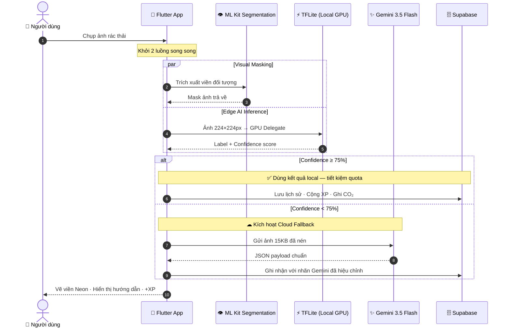
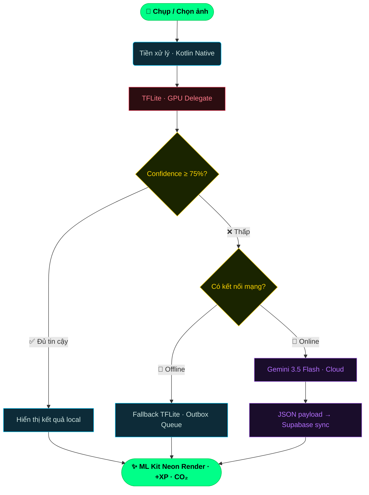

<div align="center">

<!-- HEADER BANNER -->


<!-- TYPING ANIMATION -->
<a href="https://github.com/gbao86/AI_Garbage_Classification_Application">
  
</a>

<br/>

<!-- BADGES -->
[](./CHANGELOG.md)
[](https://flutter.dev)
[](./LICENSE)
[](https://www.kaggle.com/code/jisy736386/phan-loai-rac)
[](https://drive.google.com/drive/folders/1swY2GXq4YbI0cJ71cbgdRxbpDXIc1g91?usp=sharing)

</div>

---

## 📌 Tổng quan

**EcoSort by Bao** là giải pháp phân loại rác sinh hoạt kết hợp 3 tầng công nghệ:

| Tầng | Công nghệ | Vai trò |
|:---:|:---|:---|
| 🧠 **Edge AI** | TFLite · GPU Delegate | Suy luận cục bộ &lt;15ms, không cần mạng |
| ☁ **LLM Cloud** | Gemini 3.5 Flash | Fallback thông minh khi confidence &lt;75% |
| 👁 **Vision** | ML Kit Segmentation | Vẽ viền Neon phát sáng quanh rác |

---

## 🎬 Hybrid AI Pipeline



<details>
<summary><b>📐 Xem sơ đồ Dataflow Flowchart</b></summary>



</details>

---

## 🚀 Tính năng đột phá

### 🧠 Dual AI Brain
- **TFLite Local** — `model_unquant.tflite` chạy trên GPU Delegate, 224×224px, 10 lớp, **&lt;15ms** hoàn toàn offline
- **Gemini 3.5 Flash** — auto kích hoạt khi confidence &lt;75%, trả JSON cấu trúc với hướng dẫn xử lý chi tiết
- **DB Label Sync** — Gemini hiệu chỉnh nhãn → tự đồng bộ ngược Supabase, cập nhật CO₂ + XP tương ứng

### 🛸 Neon Segmentation
- **ML Kit Subject Segmentation** chạy song song với luồng AI — không thêm latency
- Vẽ mask phát sáng theo màu nhóm: `🟢 Tái chế` · `🟤 Hữu cơ` · `🔴 Nguy hại`

### ⚡ Native Performance
- Nén ảnh tầng **Kotlin/Swift** trước khi vào Dart Isolate → Main Thread **0% blocked**
- Đạt **60/120 FPS** mượt, zero jank khi quét liên tục

### 📡 Offline-First Architecture
- **Outbox Pattern** — điểm, streak, nhiệm vụ offline ghi vào `SharedPreferences`
- Tự đồng bộ tuần tự lên Supabase khi có mạng trở lại — không bao giờ mất dữ liệu

### 🗺️ Eco Map Crowdsourcing
- CartoDB Vector Map · dark/light auto-sync
- Ghim trạm rác mới · geocode Nominatim · upload ảnh thực tế nhận XP

---

## 🧠 Mô hình AI Offline

> 📓 **Kaggle Notebook**: [Xem toàn bộ training pipeline tại đây](https://www.kaggle.com/code/jisy736386/phan-loai-rac)

**Dataset: 13,348 ảnh · 10 lớp phân loại**

| Lớp | Tên tiếng Việt | Số ảnh | Nhóm |
|:---:|:---|:---:|:---|
| 🔋 Battery | Pin cũ | 756 | ☠️ Nguy hại |
| 🥬 Biological | Hữu cơ sinh học | 699 | 🍂 Hữu cơ |
| 📦 Cardboard | Bìa Carton | 1,411 | ♻️ Tái chế |
| 👕 Clothes | Quần áo cũ | 1,892 | ♻️ Tái chế |
| 🥛 Glass | Chai lọ thủy tinh | 1,736 | ♻️ Tái chế |
| 🔩 Metal | Lon, mảnh kim loại | 930 | ♻️ Tái chế |
| 📝 Paper | Giấy vụn, sách cũ | 1,336 | ♻️ Tái chế |
| 🥤 Plastic | Chai nhựa, túi nilon | 1,597 | ♻️ Tái chế |
| 👟 Shoes | Giày dép hỏng | 1,449 | ♻️ Tái chế |
| 🗑️ Trash | Rác không tái chế khác | 453 | 🗑️ Không tái chế |

---

## 🛠️ Tech Stack

<div align="center">


</div>

---

## 📸 Giao diện ứng dụng

| 🏠 Màn hình chính | 🗺️ Bản đồ điểm đổ rác |
|:---:|:---:|
|  |  |

| 📊 Nhật ký & CO₂ | ℹ️ Về ứng dụng |
|:---:|:---:|
|  |  |

---

## 🏗️ Cài đặt & Chạy dự án

<details>
<summary><b>🛠️ Xem chi tiết quy trình thiết lập</b></summary>

### Yêu cầu
- Flutter SDK `v3.x.x`
- JDK `17+` · Gradle latest
- Tài khoản Supabase đã migrate tables
- Gemini API Key đã kích hoạt

### Các bước

```bash
# 1. Clone dự án
git clone https://github.com/gbao86/AI_Garbage_Classification_Application.git
cd AI_Garbage_Classification_Application

# 2. Cài dependencies
flutter pub get

# 3. Config biến môi trường
cp .env.example .env
# → Điền Gemini API Key + Supabase URL/Key vào .env

# 4. Build runner (sinh env.g.dart)
dart run build_runner build --delete-conflicting-outputs

# 5. Chạy!
flutter run
```

### Cấu trúc thư mục

```
phan_loai_rac_qua_hinh_anh/
├── lib/
│   ├── features/     # Game, Quiz, Outbox
│   ├── screens/      # Home, Scanning, Map, Result
│   ├── services/     # AI Gemini, TFLite, Supabase
│   ├── theme/        # Dark/Light Mode config
│   └── widgets/      # Camera, Dialog components
├── web_admin/        # HTML/JS/Vite Admin Panel
├── supabase/         # Migrations, RPC functions
└── assets/models/    # model_unquant.tflite
```

</details>


## 📥 Tải xuống

<div align="center">

[](https://drive.google.com/drive/folders/1swY2GXq4YbI0cJ71cbgdRxbpDXIc1g91?usp=drive_link)

</div>

---

<div align="center">


**Phát triển bởi [Trịnh Gia Bảo](https://github.com/gbao86) · HCMUNRE**

📧 `tiktokthu10@gmail.com`

*Garbage in, wisdom out.*

</div>