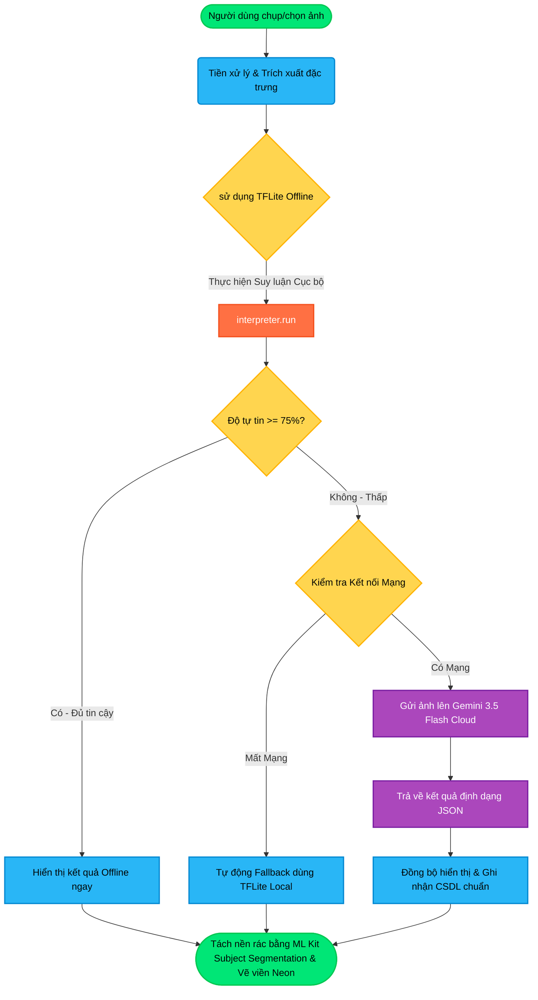
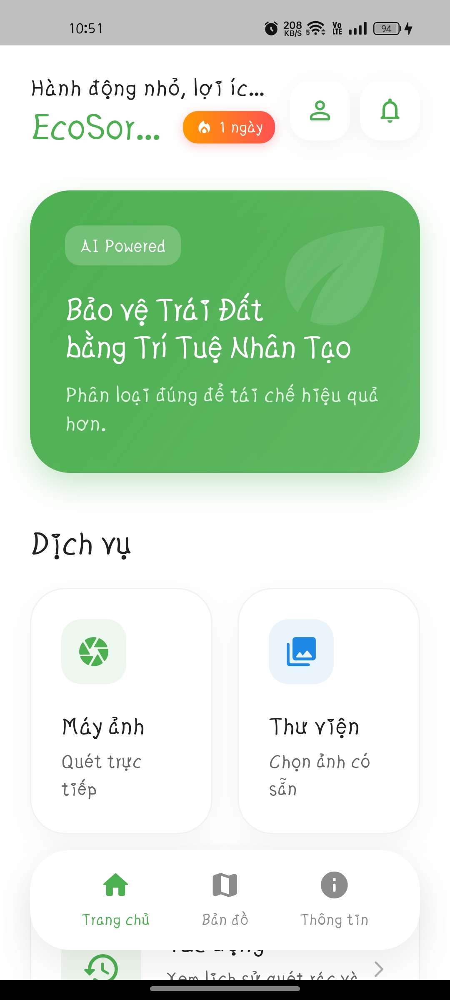
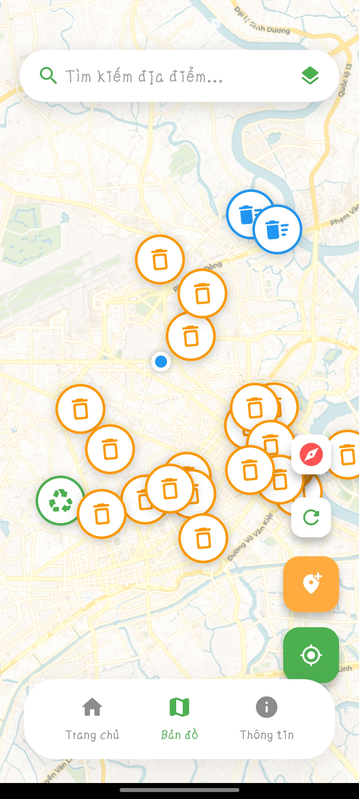
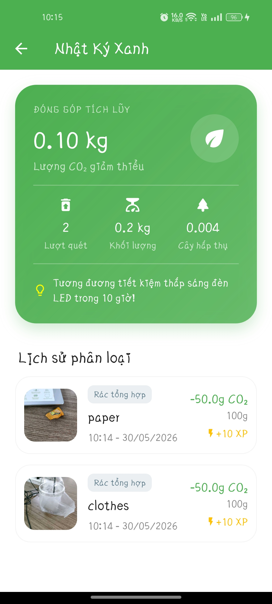
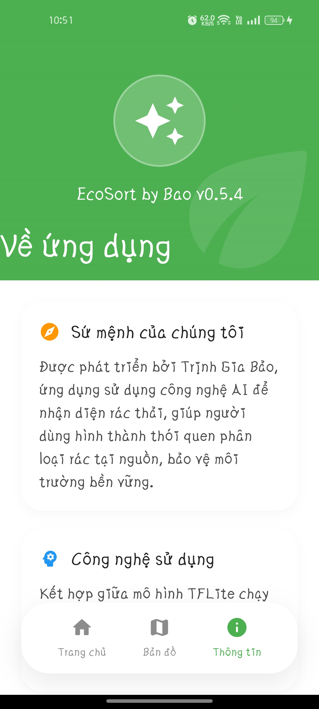

# ♻️ EcoSort by Bao - Ứng Dụng Phân Loại Rác Thông Minh

> **Sự kết hợp hoàn hảo giữa Trí tuệ nhân tạo biên (Edge AI), Mô hình ngôn ngữ lớn (LLM Cloud) và Công nghệ Tách nền thị giác (Subject Segmentation).**

---

<div align="center">

[](./CHANGELOG.md)
[](https://flutter.dev)
[](./LICENSE)
[](./SECURITY.md)

</div>

---

## 📌 Tổng quan dự án

**EcoSort by Bao** là một giải pháp công nghệ toàn diện hỗ trợ cộng đồng phân loại rác thải sinh hoạt chính xác và nhanh chóng. Bằng việc kết hợp sức mạnh xử lý cục bộ trên thiết bị và phân tích ngữ cảnh thông minh trên đám mây, ứng dụng mang lại trải nghiệm phân loại rác liền mạch và chuyên nghiệp nhất.



---

## 📸 Giao diện ứng dụng (UI/UX)

Ứng dụng sở hữu ngôn ngữ thiết kế **Premium Dark Mode & Glassmorphism**, tối ưu hóa hiển thị và mang lại cảm giác công nghệ tương lai:

| Màn hình chính (Home) | Bản đồ sinh thái (v0.5.4) |
|:---:|:---:|
|  |  |

| Nhật ký & Tác động CO₂ | Thông tin ứng dụng (About) |
|:---:|:---:|
|  |  |

---

## 🚀 Các tính năng đột phá

### 🧠 Luồng xử lý AI kép (Hybrid AI Pipeline)
*   **Edge AI (TFLite Local):** Chạy suy luận trực tiếp trên nhân xử lý đồ họa di động (GPU Delegate) bằng mô hình [model_unquant.tflite](file:///D:/App/AI%20Phan%20Loai%20Rac%20Qua%20Hinh%20Anh/phan_loai_rac_qua_hinh_anh/assets/models/model_unquant.tflite) (224x224, 10 lớp rác thải), trả kết quả trong vòng **< 15ms** mà không tốn dung lượng mạng.
*   **LLM API Cloud (Gemini 3.5 Flash):** Tích hợp gọi API thông minh bằng mô hình `gemini-3.5-flash` khi độ tin cậy của TFLite dưới **`75%`**, trả về cẩm nang xử lý rác chi tiết bằng ngôn ngữ JSON có cấu trúc.
*   **Đồng bộ hóa nhãn CSDL**: Khi Gemini hiệu chỉnh nhãn đúng, hệ thống tự động đồng bộ đè nhãn chính xác lên cơ sở dữ liệu Supabase, chỉnh sửa lượng CO₂ giảm thiểu và XP tích lũy tương ứng cho người dùng.

### 🛸 Tách nền và Vẽ hiệu ứng Neon trực quan (Subject Segmentation)
*   Tận dụng sức mạnh của **Google ML Kit Subject Segmentation** chạy ngầm song song với luồng AI phân tích.
*   Bóc tách pixel vật thể rác khỏi phông nền tĩnh và vẽ mặt nạ (Masking) phát sáng neon theo màu sắc nhóm rác (Xanh cho *Tái chế*, Nâu cho *Hữu cơ*, Đỏ cho *Nguy hại*).

### ⚡ Tối ưu hóa hiệu năng cực hạn (Extreme Engineering)
*   **Native Preprocessing**: Giải nén và nén ảnh bằng mã Kotlin/Swift ở tầng Native trước khi đưa vào luồng Dart Isolate, giải phóng 100% Main Thread tránh hiện tượng giật lag khung hình khi quét (đạt 60/120 FPS mượt mà).
*   **Offline Outbox Pattern**: Điểm số, Streak và nhiệm vụ ngày hoàn thành khi mất mạng được lưu vào hàng đợi Outbox cục bộ (`SharedPreferences`) và tự động đồng bộ tuần tự lên Supabase ngay khi thiết bị kết nối mạng trở lại.

### 🗺️ Bản đồ sinh thái Crowdsourcing
*   Sử dụng CartoDB Vector Map với các giao diện sáng/tối tự động đồng bộ với hệ thống.
*   Cho phép người dùng ghim trạm rác mới, dịch ngược địa chỉ bằng Nominatim API và tải ảnh thực tế lên hệ thống để nhận phần thưởng XP.

---

## 🧠 Chi tiết mô hình AI Offline

> 📓 **Kaggle Notebook**: Bạn có thể xem toàn bộ mã nguồn huấn luyện, xử lý dữ liệu và ma trận phân tích tại [Kaggle Notebook - Phân loại rác](https://www.kaggle.com/code/jisy736386/phan-loai-rac).

Mô hình học máy Offline được huấn luyện dựa trên bộ dữ liệu **Garbage Dataset** gồm **13,348 hình ảnh** với cấu trúc 10 lớp chi tiết:

| Lớp rác thải (Class) | Số lượng ảnh | Nhóm phân loại chính |
| :--- | :---: | :--- |
| 🔋 **Battery** (Pin cũ) | 756 | Rác Nguy hại ☠️ |
| 🥬 **Biological** (Hữu cơ sinh học) | 699 | Rác Hữu cơ 🍂 |
| 📦 **Cardboard** (Bìa Carton) | 1,411 | Rác Tái chế ♻️ |
| 👕 **Clothes** (Quần áo cũ) | 1,892 | Rác Tái chế ♻️ |
| 🥛 **Glass** (Chai lọ thủy tinh) | 1,736 | Rác Tái chế ♻️ |
| 🔩 **Metal** (Lon, mảnh kim loại) | 930 | Rác Tái chế ♻️ |
| 📝 **Paper** (Giấy vụn, sách cũ) | 1,336 | Rác Tái chế ♻️ |
| 🥤 **Plastic** (Chai nhựa, túi nilon) | 1,597 | Rác Tái chế ♻️ |
| 👟 **Shoes** (Giày dép hỏng) | 1,449 | Rác Tái chế ♻️ |
| 🗑️ **Trash** (Rác không tái chế khác) | 453 | Không tái chế 🗑️ |

---

## 🛠️ Công nghệ sử dụng

*   **Flutter / Dart**: SDK phát triển ứng dụng di động đa nền tảng.
*   **Supabase (Auth, Database, Storage, Realtime)**: Hệ thống Backend-as-a-Service để quản lý người dùng, lưu trữ hình ảnh quét và đồng bộ hóa tiến trình, điểm số thời gian thực.
*   **TensorFlow Lite**: Công cụ chạy mô hình học máy cục bộ tối ưu hóa cho di động.
*   **Google ML Kit**: Cung cấp công nghệ phân mảnh chủ thể (Subject Segmentation).
*   **Gemini API (Gemini 3.5 Flash)**: Xử lý ngôn ngữ tự nhiên và phân tích sâu hình ảnh đám mây bằng cấu trúc JSON đồng bộ.
*   **OpenStreetMap / Nominatim API**: Hệ thống bản đồ và tìm kiếm vị trí.
*   **HTML5 / CSS3 / JavaScript (Vite)**: Dành cho Dashboard trang quản trị Web Admin.

---

## 📁 Cấu trúc thư mục dự án

```text
phan_loai_rac_qua_hinh_anh/
├── lib/                      # Mã nguồn ứng dụng Flutter
│   ├── features/             # Các tính năng Game, Quiz, Outbox
│   ├── models/               # Cấu trúc dữ liệu & Model Class
│   ├── screens/              # Giao diện chính (Home, Scanning, Map, Result)
│   ├── services/             # Dịch vụ tích hợp (AI Gemini, TFLite, Supabase)
│   ├── theme/                # Cấu hình giao diện và màu sắc Dark/Light Mode
│   ├── utils/                # Tiện ích mở rộng, biến môi trường (Env)
│   └── widgets/              # Các UI Component tái sử dụng (Camera, Dialog)
├── web_admin/                # Trang web quản trị viên (HTML/JS/Vite)
├── supabase/                 # Cấu hình cơ sở dữ liệu & các hàm RPC, Migrations
├── assets/                   # Tài nguyên ảnh, mô hình AI (.tflite), danh sách nhãn
├── SECURITY.md               # Chính sách bảo mật dự án
├── CHANGELOG.md              # Nhật ký cập nhật phiên bản chi tiết
└── README.md                 # Tài liệu hướng dẫn này
```

---

## 🏗️ Hướng dẫn cài đặt & Chạy dự án

### Yêu cầu tiên quyết
*   Flutter SDK v3.x.x
*   Cài đặt Gradle và JDK 17+
*   Tài khoản Supabase đã kích hoạt các bảng trong thư mục `supabase/`

### Các bước cài đặt chi tiết

1.  **Clone dự án**:
    ```bash
    git clone https://github.com/gbao86/AI_Garbage_Classification_Application.git
    cd AI_Garbage_Classification_Application
    ```

2.  **Cài đặt các gói phụ thuộc (Dependencies)**:
    ```bash
    flutter pub get
    ```

3.  **Cấu hình biến môi trường**:
    Sao chép tệp cấu hình mẫu:
    ```bash
    cp .env.example .env
    ```
    Điền đầy đủ thông tin API Key của Gemini và Supabase vào tệp `.env`. Sau đó chạy lệnh sinh file cấu hình bảo mật `env.g.dart`:
    ```bash
    dart run build_runner build --delete-conflicting-outputs
    ```

4.  **Chạy dự án trên thiết bị**:
    ```bash
    flutter run
    ```

---

## 📥 Tải xuống & Trải nghiệm
👉 **[Tải tệp APK cài đặt bản v0.5.6 tại đây](https://drive.google.com/drive/folders/1swY2GXq4YbI0cJ71cbgdRxbpDXIc1g91?usp=sharing)**

---

**Phát triển bởi Trịnh Gia Bao (gbao86)**  
📧 Hỗ trợ kỹ thuật: tiktokthu10@gmail.com
